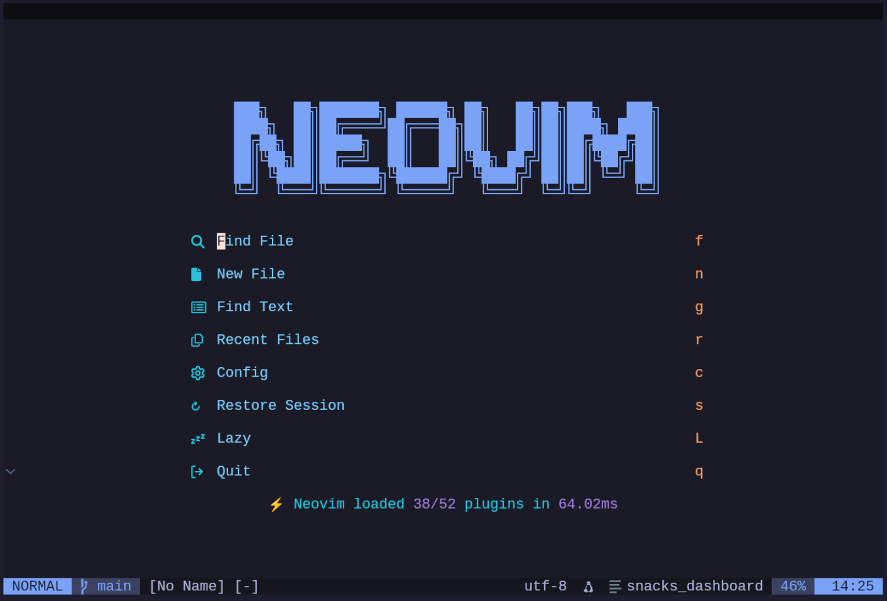
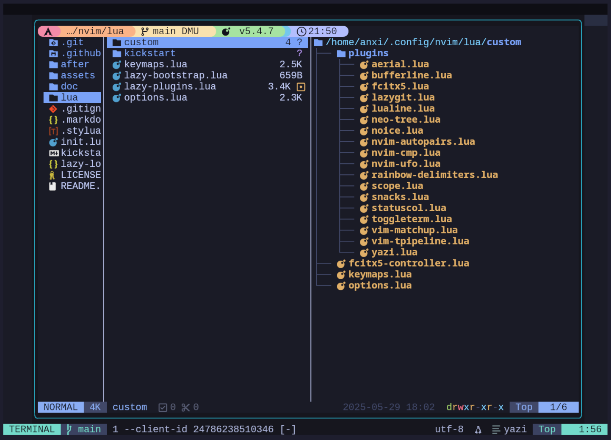
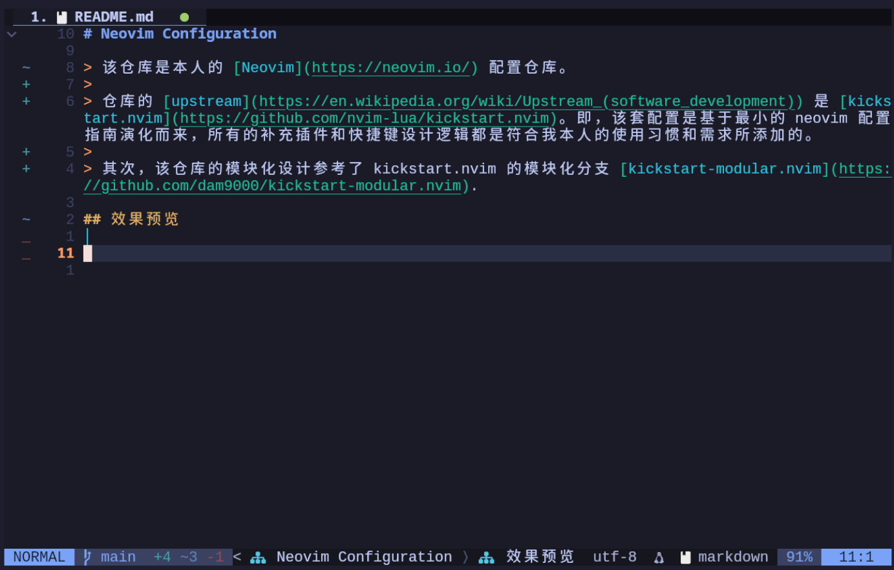
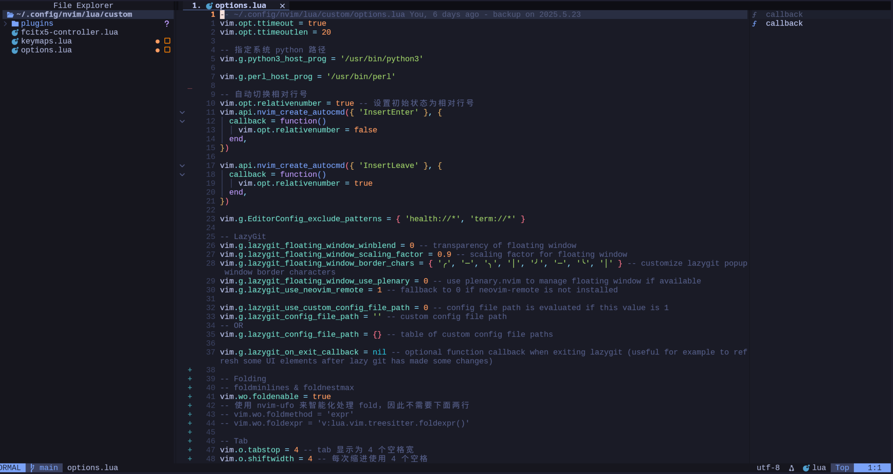
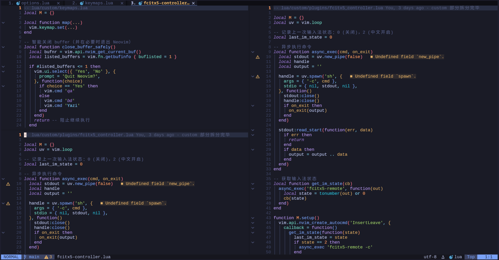

# Neovim Configuration

> 该仓库是本人的 [Neovim](https://neovim.io/) 配置仓库。
>
> 仓库的 [upstream](https://en.wikipedia.org/wiki/Upstream_(software_development)) 是 [kickstart.nvim](https://github.com/nvim-lua/kickstart.nvim)。即，该套配置是基于最小的 neovim 配置指南演化而来，所有的补充插件和快捷键设计逻辑都是符合我本人的需求和使用习惯所添加的。
>
> 其次，该仓库的模块化设计参考了 kickstart.nvim 的模块化分支 [kickstart-modular.nvim](https://github.com/dam9000/kickstart-modular.nvim).

## 效果预览

运行 `nvim` 命令可以进入上图所示界面，该页面是由 [snacks.nvim](https://github.com/folke/snacks.nvim) 插件提供的，可以进一步 customize，详情见官网。

在文件夹中打开 neovim 时，则会进入上图所示页面，这是 [Yazi](https://yazi-rs.github.io/) 提供的文件管理窗口，显示样式由 Yazi 单独的 config 设置，比如图中的 title bar 是 Yazi 插件 [starship.yazi](https://github.com/Rolv-Apneseth/starship.yazi) 提供的，而这个插件又是使用 [starship](https://starship.rs/) 的 config 渲染。

在文件中打开时，效果如上图。在这个界面可以进一步通过快捷键打开 [neo-tree](https://github.com/nvim-neo-tree/neo-tree.nvim) 和 [aerial](https://github.com/stevearc/aerial.nvim). 效果如下：

分屏显示效果如下

